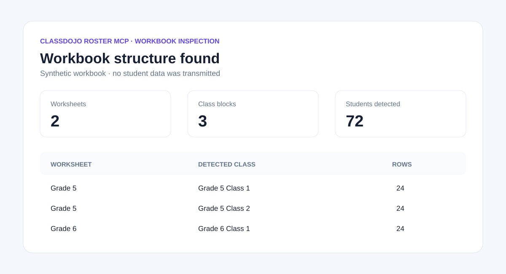
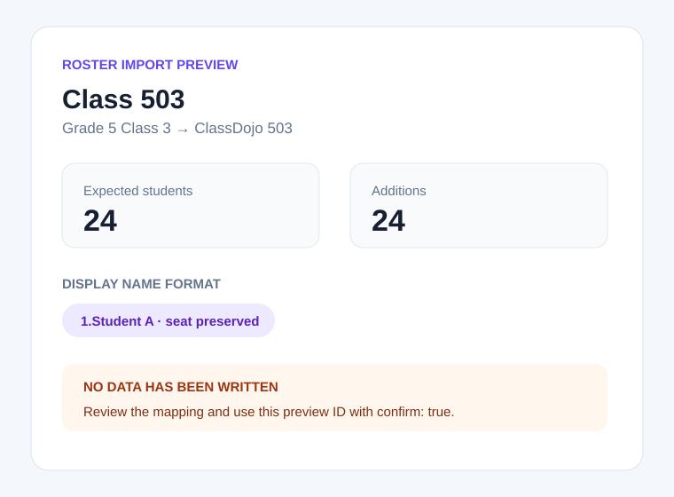
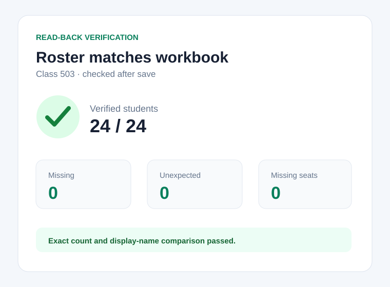

# ClassDojo Classroom MCP

[](https://github.com/Eason0in/classdojo-mcp/actions/workflows/ci.yml)
[](https://www.npmjs.com/package/classdojo-mcp)
[](https://nodejs.org/)
[](https://modelcontextprotocol.io/)
[](LICENSE)

An **unofficial, local-first Model Context Protocol (MCP) server** for teachers who need to inspect and import Excel/XLSX student rosters or review, synchronize, and verify ClassDojo classroom skills. It works with any MCP client that can launch a local stdio server, including Claude Desktop, Codex, Cursor, and VS Code.

> [!IMPORTANT]
> This community project is not affiliated with, endorsed by, or supported by ClassDojo. It uses the signed-in ClassDojo teacher website through a local browser adapter because an official public ClassDojo API/MCP is not yet available. ClassDojo UI changes may require an adapter update.

繁體中文文件：[docs/README.zh-TW.md](docs/README.zh-TW.md)

## Why this MCP server exists

ClassDojo's bulk paste flow can interpret a leading number as list numbering instead of part of a student's display name. This server keeps roster changes reviewable and supports two explicit formats:

- `seat_number_dot_name`: creates names such as `1.Student A` one at a time so the seat number is preserved.
- `name_only`: uses ClassDojo's faster bulk paste flow when seat numbers are not needed; it is rejected if a source class contains duplicate names.

Every write requires a fresh 15-minute preview ID plus `confirm: true`. After saving, the server reads the class back and compares names and counts.

## What it can do

| Tool | Writes data | Purpose |
| --- | --- | --- |
| `classdojo_doctor` | No | Check the local browser connection, login state, and visible classes. |
| `classdojo_list_classes` | No | List visible three-digit classes in the teacher session. |
| `classdojo_inspect_workbook` | No | Scan every sheet for likely class, seat-number, and student-name columns. |
| `classdojo_get_roster` | No | Read a current ClassDojo class roster. |
| `classdojo_get_skills` | No | Read positive and needs-work skills with points and icons. |
| `classdojo_get_ui_state` | No | Detect dialogs that may block roster work; it never dismisses them. |
| `classdojo_preview_roster_import` | No | Compare workbook students with ClassDojo and create a short-lived preview ID. |
| `classdojo_apply_roster_import` | Yes | Apply one preview with `confirm: true`, save, and read back for verification. |
| `classdojo_verify_roster_against_workbook` | No | Compare expected and actual counts, missing names, and unexpected names. |
| `classdojo_preview_skill_sync` | No | Compare a preset, source class, or inline rule list with target classes and create a short-lived preview ID. |
| `classdojo_apply_skill_sync` | Yes | Exactly synchronize one skill preview with `confirm: true`, then read every class back. |
| `classdojo_verify_skill_sync` | No | Independently compare current skills with the selected rule source. |

The `classdojo_configure_skill_rules` MCP prompt guides a client through the built-in `traditional_chinese_classroom_v1` preset, asks whether the user wants changes, shows the complete final list, and keeps preview, approval, apply, and verification as separate steps.

The workbook inspector does not assume fixed sheet names or column positions. It scans the whole workbook for common Chinese and English class/seat/name headers. Preview and verification then require an explicit non-empty `sheetNames` selection plus class mappings, preventing an Agent from silently combining duplicate or unrelated sheets.

## Safe workflow



1. Run `classdojo_doctor`.
2. Run `classdojo_inspect_workbook` and select the intended sheet and detected class blocks.
3. Run `classdojo_preview_roster_import` with an explicit `studentNameFormat`.
4. Review class mappings, counts, missing seat numbers, and additions.
5. Only after human approval, call `classdojo_apply_roster_import` with the returned `previewId` and `confirm: true`.
6. Run `classdojo_verify_roster_against_workbook` for an independent read-back check.

| Preview | Read-back verification |
| --- | --- |
|  |  |

All screenshots contain synthetic data only.

## Safe classroom-skill workflow

The built-in Traditional Chinese preset contains nine positive skills and six needs-work skills. It is public package data and uses a neutral preset ID; it does not contain a teacher name, account identifier, or student data.

1. Start with the `classdojo_configure_skill_rules` prompt, or call `classdojo_get_skills` to inspect a source class.
2. Review the complete preset and make any additions, removals, point changes, or icon changes.
3. Call `classdojo_preview_skill_sync` with exactly one source: the built-in preset, a three-digit source class, or a complete inline skill list.
4. Review every target's additions, updates, and removals.
5. Only after human approval, call `classdojo_apply_skill_sync` with the one-time `previewId` and `confirm: true`.
6. Call `classdojo_verify_skill_sync` for an independent comparison.

Skill synchronization is an exact replacement. If a class changes after preview, the apply stops rather than overwriting the newer state. Matching classes are left unchanged, and a partial failure requires a fresh preview before retrying.

## Requirements

- Node.js 20 or newer
- Chrome or another Chromium browser with Chrome DevTools Protocol (CDP)
- A ClassDojo teacher account that you sign in to yourself
- An MCP client that supports local stdio servers

The MCP server never asks for a ClassDojo password, cookie, or API token.

## Start the local browser adapter

Use a dedicated browser profile and sign in to ClassDojo in that window.

### macOS

```bash
open -na "Google Chrome" --args \
  --remote-debugging-port=9222 \
  --user-data-dir="$HOME/.classdojo-mcp-chrome"
```

### Linux

```bash
google-chrome \
  --remote-debugging-port=9222 \
  --user-data-dir="$HOME/.classdojo-mcp-chrome"
```

### Windows PowerShell

```powershell
& "$env:ProgramFiles\\Google\\Chrome\\Application\\chrome.exe" \`
  --remote-debugging-port=9222 \`
  --user-data-dir="$env:LOCALAPPDATA\\classdojo-mcp-chrome"
```

Keep the debugging port on loopback. Anyone who can reach a CDP endpoint may be able to control its browser session.

## Install in an MCP client

Install from the public npm package with the same command in every client:

```text
npx -y classdojo-mcp
```

Contributors can alternatively clone this repository, run `npm ci && npm run build`, and replace the command with `node` plus the absolute path to `dist/cli.js`.

### Claude Desktop and Cursor

```json
{
  "mcpServers": {
    "classdojo": {
      "command": "npx",
      "args": ["-y", "classdojo-mcp"],
      "env": {
        "CLASSDOJO_CDP_URL": "http://127.0.0.1:9222"
      }
    }
  }
}
```

### VS Code

```json
{
  "servers": {
    "classdojo": {
      "type": "stdio",
      "command": "npx",
      "args": ["-y", "classdojo-mcp"],
      "env": {
        "CLASSDOJO_CDP_URL": "http://127.0.0.1:9222"
      }
    }
  }
}
```

### Codex

Add this to `~/.codex/config.toml`:

```toml
[mcp_servers.classdojo]
command = "npx"
args = ["-y", "classdojo-mcp"]

[mcp_servers.classdojo.env]
CLASSDOJO_CDP_URL = "http://127.0.0.1:9222"
```

Client UI and configuration locations change over time; refer to the client's current documentation. The transport itself is standard MCP stdio and is not Codex-specific.

## Example tool inputs

Inspect a workbook first:

```json
{
  "workbookPath": "/absolute/path/to/students.xlsx"
}
```

Create a preview with synthetic class mappings:

```json
{
  "workbookPath": "/absolute/path/to/students.xlsx",
  "sheetNames": ["Grade 5"],
  "studentNameFormat": "seat_number_dot_name",
  "includeStudentDetails": false,
  "mappings": [
    {
      "classdojoClassName": "503",
      "sourceClassName": "Grade 5 Class 3"
    }
  ]
}
```

Apply only after reviewing the preview:

```json
{
  "previewId": "00000000-0000-4000-8000-000000000000",
  "confirm": true
}
```

Preview IDs expire after 15 minutes, live only in the running MCP process, and are consumed by the first apply attempt. This reduces accidental replay and duplicate imports. If one class fails, the result names the verified classes and the classes that can be retried after generating a new preview.

Preview the built-in classroom-skill preset for multiple targets:

```json
{
  "rulesSource": {
    "type": "preset",
    "presetId": "traditional_chinese_classroom_v1"
  },
  "targetClassNames": ["502", "503", "504"]
}
```

Use `{"type":"class","className":"501"}` to copy a live source class. To modify the preset, send `{"type":"inline","skills":[...]}` with the complete final list; each rule requires `category`, `name`, and integer `points`, while `iconId` is optional. Positive points must be `0..5`, needs-work points must be `-5..0`, and names must be unique.

## Privacy and security

- Workbook parsing and browser automation run locally on the teacher's computer.
- The project does not run a hosted MCP service and does not persist credentials or student rosters.
- Student names may still pass through the selected MCP client/AI provider. Review that provider's retention and privacy terms before using real student data.
- Never attach real workbooks, student screenshots, browser profiles, cookies, or diagnostic logs containing personal data to a public issue.
- Writable operations are limited to confirmed roster imports and confirmed classroom-skill synchronization. Awarding points, attendance, messaging, family invitations, and other ClassDojo features remain unavailable.

See [docs/PRIVACY.md](docs/PRIVACY.md), [SECURITY.md](SECURITY.md), and the [threat model](docs/THREAT-MODEL.md).

## Troubleshooting

| Symptom | Check |
| --- | --- |
| Browser connection fails | Confirm the dedicated Chrome window is still running with `--remote-debugging-port=9222`. |
| Not logged in | Sign in manually in the dedicated window, then rerun `classdojo_doctor`. |
| No classes are visible | Open the teacher class page and confirm the account has access. |
| Import is blocked | Run `classdojo_get_ui_state`; close family-invitation or welcome dialogs yourself. |
| Seat numbers disappear | Use `studentNameFormat: "seat_number_dot_name"`; bulk paste is only used for `name_only`. |
| Workbook columns are not detected | Open an issue with a synthetic workbook that reproduces the header layout. |
| Verification differs | Stop writing, compare `missingStudents` and `unexpectedStudents`, then create a new preview. |

## Project status and roadmap

Version `0.2.x` is experimental. The web UI adapter is intentionally isolated so a future official ClassDojo API can replace it without changing the public MCP tool workflow.

Planned work:

- additional synthetic workbook layouts and locale coverage
- MCP client compatibility matrix and Inspector smoke tests
- official API adapter if ClassDojo grants Early Access
- optional read-only tools only after a privacy and permissions review

This project will not reverse-engineer or promise undocumented ClassDojo REST endpoints as a stable public API.

## Development

```bash
npm ci
npm test
npm run build
npm audit --omit=dev
npm pack --dry-run
```

The stdio protocol uses stdout; never add `console.log` calls to the server. Use stderr for diagnostics. See [CONTRIBUTING.md](CONTRIBUTING.md) before opening a pull request.

## Community metadata and release

- MCP Registry name: `io.github.Eason0in/classdojo-mcp`
- npm package: `classdojo-mcp`
- transport: `stdio`
- license: MIT

`server.json` and `package.json#mcpName` intentionally match the MCP Registry ownership format. The release workflow is prepared for a protected GitHub Actions environment, npm Trusted Publishing, provenance, and MCP Registry OIDC; it is not usable until the maintainer explicitly configures the `release` environment and npm publisher. No long-lived npm token belongs in this repository.

## License

[MIT](LICENSE) © Eason0in
